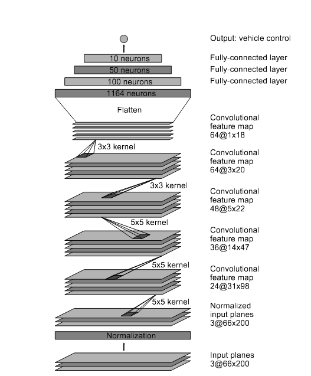
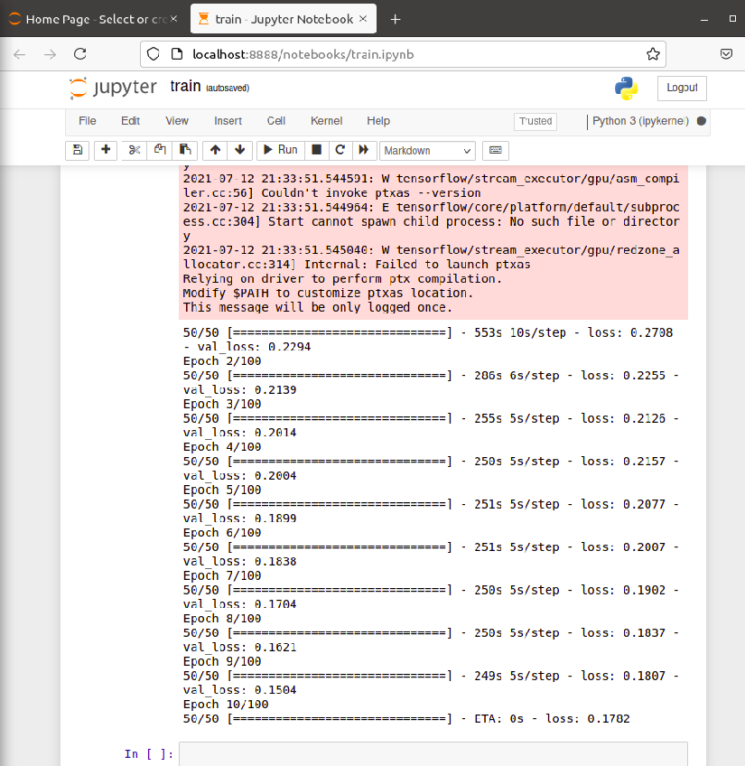
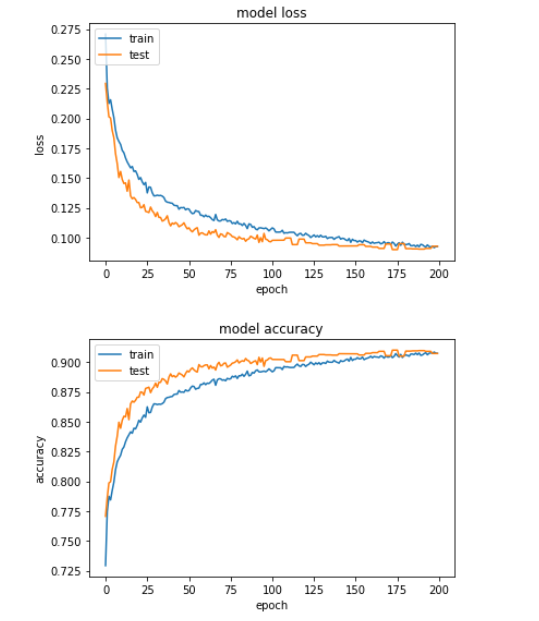

# Self Driving Car

This repository is used to emphasize UDACITY self-driving car dataset.

## Library dependency

* tensorflow~=2.5.0
* opencv-python~=4.5.2.54
* numpy~=1.19.5
* sklearn~=0.0
* matplotlib~=3.4.2

* pandas~=1.3.0
* scikit-learn~=0.24.2
* imgaug~=0.4.0
* python-engineio=3.13.2
* eventlet~=0.31.1
* Pillow~=8.3.1
* Flask~=2.0.1

```shell
$ pip3 install -r requirements.txt
```

## Model

The CNN Model used here is being proposed by NVIDIA for self-driving Cars



```text
Model: "sequential"
_________________________________________________________________
Layer (type)                 Output Shape              Param #   
=================================================================
conv2d (Conv2D)              (None, 31, 98, 24)        1824      
_________________________________________________________________
conv2d_1 (Conv2D)            (None, 14, 47, 36)        21636     
_________________________________________________________________
conv2d_2 (Conv2D)            (None, 5, 22, 48)         43248     
_________________________________________________________________
conv2d_3 (Conv2D)            (None, 3, 20, 64)         27712     
_________________________________________________________________
conv2d_4 (Conv2D)            (None, 1, 18, 64)         36928     
_________________________________________________________________
flatten (Flatten)            (None, 1152)              0         
_________________________________________________________________
dense (Dense)                (None, 100)               115300    
_________________________________________________________________
dense_1 (Dense)              (None, 50)                5050      
_________________________________________________________________
dense_2 (Dense)              (None, 10)                510       
_________________________________________________________________
dense_3 (Dense)              (None, 1)                 11        
=================================================================
Total params: 252,219
Trainable params: 252,219
Non-trainable params: 0
```

## Tensorflow Installation (GPU)

### System Info

1. CPU Intel i7
2. RAM 16GB
3. NVIDIA 1050 GTX
4. Ubuntu 20.04

### Repository Structure

```text
Self-driving-car
|__ train.ipynb
|__ .gitignore
|__ README.md
|__ LICENSE
|__ Utils
|      |__ utils.py
|      |__ test_gpu.py
|__ dataset
|      |__ driving_log.csv
|      |__ IMG
|            |__ ....jpg
```

### NVIDIA GPU Installation

```shell
# Add NVIDIA package repositories
$ wget https://developer.download.nvidia.com/compute/cuda/repos/ubuntu1804/x86_64/cuda-ubuntu1804.pin
$ sudo mv cuda-ubuntu1804.pin /etc/apt/preferences.d/cuda-repository-pin-600
$ sudo apt-key adv --fetch-keys https://developer.download.nvidia.com/compute/cuda/repos/ubuntu1804/x86_64/7fa2af80.pub
$ sudo add-apt-repository "deb https://developer.download.nvidia.com/compute/cuda/repos/ubuntu1804/x86_64/ /"
$ sudo apt-get update

$ wget http://developer.download.nvidia.com/compute/machine-learning/repos/ubuntu1804/x86_64/nvidia-machine-learning-repo-ubuntu1804_1.0.0-1_amd64.deb

$ sudo apt install ./nvidia-machine-learning-repo-ubuntu1804_1.0.0-1_amd64.deb
$ sudo apt-get update

$ wget https://developer.download.nvidia.com/compute/machine-learning/repos/ubuntu1804/x86_64/libnvinfer7_7.1.3-1+cuda11.0_amd64.deb
$ sudo apt install ./libnvinfer7_7.1.3-1+cuda11.0_amd64.deb
$ sudo apt-get update

# Install development and runtime libraries (~4GB)
$ sudo apt-get install --no-install-recommends \
    cuda-11-0 \
    libcudnn8=8.0.4.30-1+cuda11.0  \
    libcudnn8-dev=8.0.4.30-1+cuda11.0

# Reboot. Check that GPUs are visible using the command: nvidia-smi
$ nvidia-smi
```

```shell
# Output Example of nvidia-smi
+-----------------------------------------------------------------------------+
| NVIDIA-SMI 470.42.01    Driver Version: 470.42.01    CUDA Version: 11.0     |
|-------------------------------+----------------------+----------------------+
| GPU  Name        Persistence-M| Bus-Id        Disp.A | Volatile Uncorr. ECC |
| Fan  Temp  Perf  Pwr:Usage/Cap|         Memory-Usage | GPU-Util  Compute M. |
|                               |                      |               MIG M. |
|===============================+======================+======================|
|   0  NVIDIA GeForce ...  On   | 00000000:01:00.0 Off |                  N/A |
| N/A   42C    P8    N/A /  N/A |     11MiB /  4042MiB |      0%      Default |
|                               |                      |                  N/A |
+-------------------------------+----------------------+----------------------+
                                                                               
+-----------------------------------------------------------------------------+
| Processes:                                                                  |
|  GPU   GI   CI        PID   Type   Process name                  GPU Memory |
|        ID   ID                                                   Usage      |
|=============================================================================|
|    0   N/A  N/A      1268      G   /usr/lib/xorg/Xorg                  4MiB |
|    0   N/A  N/A      1753      G   /usr/lib/xorg/Xorg                  4MiB |
+-----------------------------------------------------------------------------+

```

```shell
# Install TensorRT. Requires that libcudnn8 is installed above.
$ sudo apt-get install -y --no-install-recommends libnvinfer7=7.1.3-1+cuda11.0 \
    libnvinfer-dev=7.1.3-1+cuda11.0 \
    libnvinfer-plugin7=7.1.3-1+cuda11.0
```

```shell
# Add Soft link to libcusolver
$ cd /usr/local/cuda/lib64
$ sudo ln -s $(pwd)/libcusolver.so.10  $(pwd)/libcusolver.so.11
```

```shell
# Set LD_LIBRARY_PATH to ~/.bashrc
$ cd /usr/local/cuda/lib64
$ echo 'export LD_LIBRARY=$(pwd)' >> ~/.bashrc
```

Pycharm LD_LIBRARY Setup
[Stackoverflow #33812902](https://stackoverflow.com/questions/33812902/pycharm-cannot-find-library)

### Tensorflow Installation

```shell
$ pip3 install tensorflow
$ python3 test_gpu.py
```

```shell
# output:
2021-07-10 20:56:56.563751: I tensorflow/stream_executor/platform/default/dso_loader.cc:53] Successfully opened dynamic library libcudart.so.11.0
2021-07-10 20:56:57.336122: I tensorflow/stream_executor/platform/default/dso_loader.cc:53] Successfully opened dynamic library libcuda.so.1
2021-07-10 20:56:57.358240: I tensorflow/stream_executor/cuda/cuda_gpu_executor.cc:937] successful NUMA node read from SysFS had negative value (-1), but there must be at least one NUMA node, so returning NUMA node zero
2021-07-10 20:56:57.358784: I tensorflow/core/common_runtime/gpu/gpu_device.cc:1733] Found device 0 with properties: 
pciBusID: 0000:01:00.0 name: NVIDIA GeForce GTX 1050 computeCapability: 6.1
coreClock: 1.493GHz coreCount: 5 deviceMemorySize: 3.95GiB deviceMemoryBandwidth: 104.43GiB/s
2021-07-10 20:56:57.358801: I tensorflow/stream_executor/platform/default/dso_loader.cc:53] Successfully opened dynamic library libcudart.so.11.0
2021-07-10 20:56:57.360613: I tensorflow/stream_executor/platform/default/dso_loader.cc:53] Successfully opened dynamic library libcublas.so.11
2021-07-10 20:56:57.360648: I tensorflow/stream_executor/platform/default/dso_loader.cc:53] Successfully opened dynamic library libcublasLt.so.11
2021-07-10 20:56:57.361401: I tensorflow/stream_executor/platform/default/dso_loader.cc:53] Successfully opened dynamic library libcufft.so.10
2021-07-10 20:56:57.361643: I tensorflow/stream_executor/platform/default/dso_loader.cc:53] Successfully opened dynamic library libcurand.so.10
2021-07-10 20:56:57.363797: I tensorflow/stream_executor/platform/default/dso_loader.cc:53] Successfully opened dynamic library libcusolver.so.11
2021-07-10 20:56:57.364300: I tensorflow/stream_executor/platform/default/dso_loader.cc:53] Successfully opened dynamic library libcusparse.so.11
2021-07-10 20:56:57.364410: I tensorflow/stream_executor/platform/default/dso_loader.cc:53] Successfully opened dynamic library libcudnn.so.8
2021-07-10 20:56:57.364483: I tensorflow/stream_executor/cuda/cuda_gpu_executor.cc:937] successful NUMA node read from SysFS had negative value (-1), but there must be at least one NUMA node, so returning NUMA node zero
2021-07-10 20:56:57.365078: I tensorflow/stream_executor/cuda/cuda_gpu_executor.cc:937] successful NUMA node read from SysFS had negative value (-1), but there must be at least one NUMA node, so returning NUMA node zero
2021-07-10 20:56:57.365533: I tensorflow/core/common_runtime/gpu/gpu_device.cc:1871] Adding visible gpu devices: 0
[PhysicalDevice(name='/physical_device:GPU:0', device_type='GPU')]
```

## Dataset

Used Dataset found on [Kaggle](https://www.kaggle.com/zaynena/selfdriving-car-simulator)
Download the dataset and unzip it at the root folder

## Training

Use [train.ipynb](train.ipynb) to train the model.





## Reference

[Tensorflow-GPU](https://www.tensorflow.org/install/gpu#linux_setup)